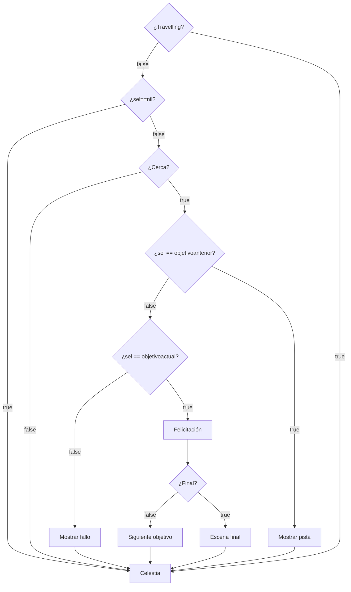

# Búsqueda del Tesoro Espacial:

Este es un script para el programa [Celestia](https://celestiaproject.space/) que permite realizar una "búsqueda del tesoro espacial" o una persecución similar a la del famoso juego ["¿Dónde está Carmen San Diego?"](https://www.clasicosbasicos.org/juegos/aventura-grafica/donde-esta-carmen-sandiego-buscala-por-todo-el-mundo).

No es necesario instalar nada. Solo descargar el código y ejecutar el script Persecución.sh o Persecución.bat según el sistema operativo Linux o Windows.

## Para docentes o quienes quieran crear sus propios recorridos:

[Video explicativo](https://youtu.be/PUFqwxdwHwg)

Para crear nuevos recorridos/persecuciones se puede utilizar la página web que está dentro de la carpeta CrearRecorridos.

Para ejecutar luego el recorrido creado debe copiarlo en la carpeta en la que se encuentra Persecucion.celx y ejecutar el script de la siguiente forma.

(en Linux)
```bash
  ./Persecución.sh contenido.lua
```

(en Windows)
```powershell
  ./Persecución.bat contenido.lua
```

* Reemplazar contenido.lua por el archivo generado por el creador de contenidos o por el contenido deseado.

Los archivos de imagenes y sonidos deben guardarse en la carpeta de imágenes y sonidos del script Persecucion.celx

El script funciona en **Celestia 1.7.0 para linux**. En  una instalación de una versión anterior no funcionó. También funciona bien en **Celestia 1.6.2.2 para Windows** (Gracias a Ricardo Tohmé por probarlo).
No sé a partir de que version se incorpora la función para agregar imágenes en celestia (overlay) así que en versiones previas a la 1.7 no funciona el script si están las imágenes habilitadas. Para deshabilitarlas agregar al archivo de contenido la instrucción

```lua
  noimagen = true
```

En caso de utilizarlo como búsqueda del tesoro la etiqueta *felicitacion* funciona como su nombre indica. Si se hace una persecución espacial, la *felicitacion* cambia de sentido y sirve para explicar como, a pesar de haber llegado al destino resolviendo la pista, el *ladrón espacial* se nos escapa y se va al siguiente destino.

Por ahora los recorridos/persecuciones creados no se pueden modificar facilmente (Hay que editar manualmente el archivo .lua creado).

## Para programadores:

La clave para realizar este script fue este apartado de la documentación de Celestia en el [wikibook](https://en.wikibooks.org/wiki/Celestia/Celx_Scripting/CELX_Lua_Methods).

>> Celestia works roughly(!) by repeating this:

    Check user input, change rendering settings accordingly (e.g. enable rendering of orbits, change observer position/orientation)
    Update the simulation time
    Update the observer's position if goto is active
    Render all objects using the current settings (renderflags, time. positions)

Con mi rudimentario inglés y con ayuda del traductor comprendí por fin que el comando **wait** devuelve el control a Celestia y por lo tanto el usuario puede seguir navegando hacia donde quiera.

También me sirvió ver los propios script que trae el programa para comprender que se pueden lanzar bucles que sigan corriendo en paralelo al ciclo principal de Celestia.

```lua
  while true do
    ... código ..
  end
```

Se me ocurren muchas mejoras que se pueden hacer al script e invito a la comunidad a colaborar. Entre ellas están:

* Detección múltiple de lugares a los que llega el usuario para dar diferentes mensajes.
* Mejorar el sistema de creación de recorridos/persecuciones.

# Diagrama de funcionamiento


