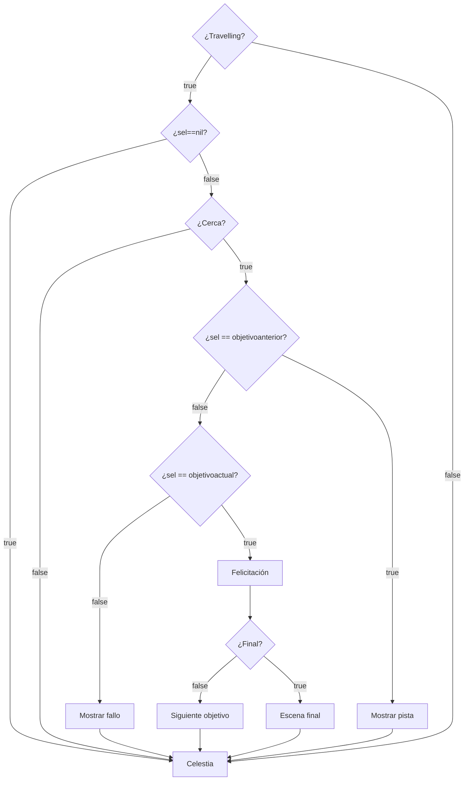

# Búsqueda del Tesoro Espacial:

Este es un script para el programa [Celestia](https://celestiaproject.space/) que permite realizar una "búsqueda del tesoro espacial" o una persecución similar a la del famoso juego ["¿Dónde está Carmen San Diego?"](https://www.clasicosbasicos.org/juegos/aventura-grafica/donde-esta-carmen-sandiego-buscala-por-todo-el-mundo).

No es necesario instalar nada. Solo abrir Celestia y hacer clic en archivo/abrir script. Luego elegir el archivo Persecución.celx.

## Para docentes o quienes quieran crear sus propios recorridos:

[Video explicativo](https://youtu.be/PUFqwxdwHwg)

Para modificar los recorridos hay que editar el archivo contenido.lua o copiarlo en otro archivo y llamar el nuevo archivo desde la linea correspondiente del archivo Persecución.celx

Es decir, reemplazar el nombre del archivo que se indica entre comillas por el archivo nuevo.
```lua
  (pathname .. "contenido.lua")
```

El script funciona en **Celestia 1.7.0 para linux**. En  una instalación de una versión anterior no funcionó. También funciona bien en **Celestia 1.6.2.2 para Windows** (Gracias a Ricardo Tohmé por probarlo).

En caso de utilizarlo como búsqueda del tesoro la etiqueta *felicitacion* funciona como su nombre indica. Si se hace una persecución espacial, la *felicitacion* cambia de sentido y sirve para explicar como, a pesar de haber llegado al destino resolviendo la pista, el *ladrón espacial* se nos escapa y se va al siguiente destino.

Por cada punto del recorrido se debe agregar una linea como la siguiente:

```lua
    {   objetivo = "Objeto al cual llegar",
        pistas = { 
            { texto = "Agente de viajes: Quería saber si había hotel disponible en la cara oculta.", personaje = "personaje01.png" }
        },
        felicitacion = "Elongast estuvo aquí pero ha escapado nuevamente.",
    },
```

Nótese que se pueden agregar más pistas dentro de las llaves.

También se puede agregar mensajes de fallos dentro de cada punto del recorrido.


```lua
      fallos = { "No che, estás perdido.", "Aquí nadie lo ha visto"},
```

Tener mucho cuidado con las comas y espacios. Deben quedar igual. Solo modificar lo que está entre comillas.

## Para programadores:

La clave para realizar este script fue este apartado de la documentación de Celestia en el [wikibook](https://en.wikibooks.org/wiki/Celestia/Celx_Scripting/CELX_Lua_Methods).

>> Celestia works roughly(!) by repeating this:

    Check user input, change rendering settings accordingly (e.g. enable rendering of orbits, change observer position/orientation)
    Update the simulation time
    Update the observer's position if goto is active
    Render all objects using the current settings (renderflags, time. positions)

Con mi rudimentario inglés y con ayuda del traductor comprendí por fin que el comando **wait** devuelve el control a Celestia y por lo tanto el usuario puede seguir navegando hacia donde quiera.

También me sirvió ver los propios script que trae el programa para comprender que se pueden lanzar bucles que sigan corriendo en paralelo al ciclo principal de Celestia.

```lua
  while true do
    ... código ..
  end
```

Se me ocurren muchas mejoras que se pueden hacer al script e invito a la comunidad a colaborar. Entre ellas están:

* Detección múltiple de lugares a los que llega el usuario para dar diferentes mensajes.
* Algún sistema de edición menos técnico para los docentes u otras personas que quieran crear sus propios recorridos.

# Diagrama de funcionamiento


